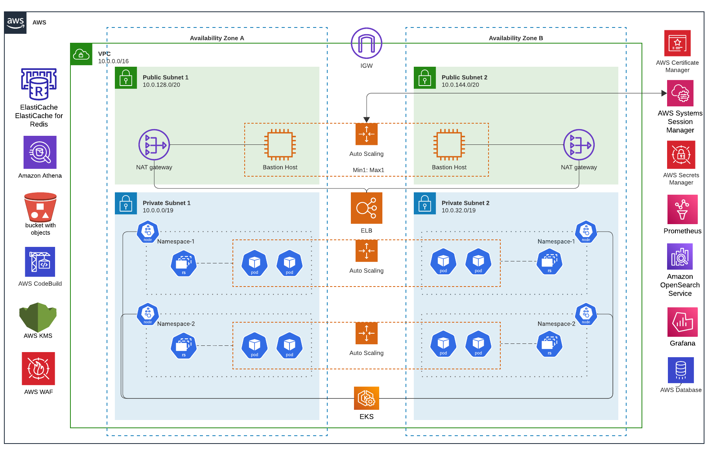

- [Introduction](#introduction)
- [The High-Level Architecture](#the-high-level-architecture)

## Introduction

SourceFuse Reference Architecture to implement a EKS multi-tenant software-as-a-service (SaaS) solution. The purpose of this document is to give the architecture design specifics that will bring insight to how a Saas solution using **ARC** is structured, organized and works internally. SourceFuse has developed a demonstration EKS SaaS solution aimed at illustrating the key architectural and design principles essential for constructing a multi-tenant SaaS platform on AWS. This example serves as a practical reference for developers and architects seeking to implement best practices in their own projects. The programming model, cost efficiency, security, deployment, and operational attributes of EKS represent a compelling model for SaaS providers.

In the upcoming sections, we'll delve into the mechanics of this multi-tenant SaaS EKS solution setup. We'll dissect the fundamental architectural tactics employed to tackle issues for tenants such as isolation, identity management, data segmentation, routing efficiency, deployment workflows, tenant management and operational complexities inherent in crafting and delivering an EKS-based SaaS solution on AWS. Additionally, we've integrated a tailored observability stack for each tenant, encompassing monitoring and logging functionalities. Furthermore, we'll delve into the billing component of this SaaS solution, leveraging Kubecost and Grafana dashboards for comprehensive insights. This comprehensive exploration aims to furnish you with a hands-on comprehension of the entire system.

This document is intended for developers and architects who have experience on AWS, Terraform. A working knowledge of both Kubernetes and Docker is also helpful. 

## The High-Level Architecture

Before we delve into the specifics of the SaaS EKS solution, let's first examine the overarching elements of the architecture. In Figure 1, you'll find an overview of the foundational layers comprising the SaaS architecture environment.

Figure1 - High-level EKS SaaS Architecture

ARC SaaS architecture consists of two major layers at a high level - 

1. **Control Plane** - The control plane is foundational to any multi-tenant SaaS model. ARC SaaS control plane will include those services that give consumers the ability to manage and operate their tenants through a single, unified experience. Within the control plane, we have 3-tier architecture supporting UI (or some CLI), API and data separately. The core services here represent the collection of services that are used to orchestrate multi-tenant experience. We’ve included some of the common examples of services that are typically part of the core. However, these core services could vary for each SaaS solution depending on the requirements. In the architecture diagram above, we have also shown a separate administration application UI. This represents the application (a web application, a command line interface, or an API) that might be used by a SaaS provider to manage their multi-tenant environment. Please note that the control plane and its services are not actually multi-tenant. These services are global to all tenants and are basically used to operate and manage tenants.

2. **Application Plane** - At the bottom of the diagram, we have represented the application plane of a SaaS environment. This is where the multi-tenant functionality of the actual application will reside.

Figure2 - AWS Physical EKS SaaS Architecture
